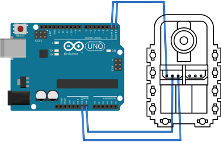

ardyno
======

Arduino library for dynamixel servos

This library allows you to control the Robotis servo motors that use a custom half-duplex serial protocol. 
You can control TTL models directly from Arduino, without any additional hardware, using hardware or software UART.
Communication speed up to 1 MBd is supported with hardware serial.
The most useful functions (speed, position, wheel/joint mode, ...) are provided via a very simple high level interface (see test_motor example), but other operations can be done using the generic read/write functions (see test_led example).

#Installation

Ardyno is available in the Arduino Library Manager, or you can get it directly from github repository if you want last version (may be unstable)

#Usage

To control TTL motors, without any additionnal hardware:
You can use a 9V or 12V power supply to power the arduino and motors.
Connect GND and VIN pins of the adruino and dynamixel device, and tx and rx pins of the arduino to the data pin of your dynamixel device (see image below).

To control TTL/RS485 motors, with an additionnal hardware buffer:
See Robotis documentation

#Troubleshooting

- If the servo is configured to answer immediatly to commands, the response packet may come back too fast and be missed by the arduino, and communication may become unstable or even impossible. To fix this, you have to write the value of the "Return Delay Time" register back to its orginal value (register 0x05, value 250).
